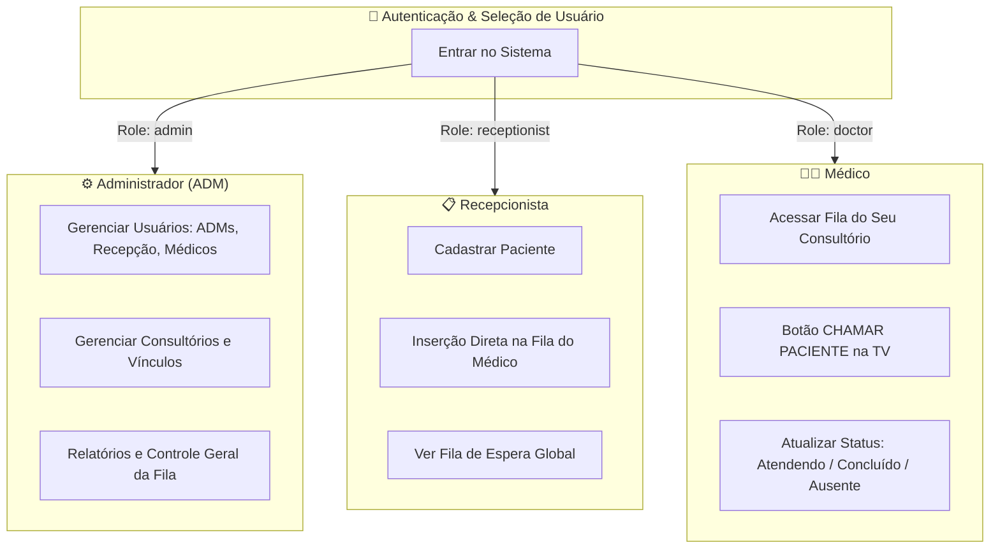

# Plano de Implementação - Sistema de Atendimento Médico CMIP

Sistema de **Atendimento Médico Direto (sem triagem)** com **Controle de Acesso por Usuários (Administradores, Recepcionistas e Médicos)**, Cadastro de Consultórios/Médicos, Chamada de Pacientes por Nome e Painel de TV com anúncio sonoro por voz (TTS).

---

## 1. Perfis de Usuário & Controle de Acesso (Roles)

O sistema contará com 3 papéis (roles) de acesso bem definidos:



1. **👑 Administrador (ADM)**:
   - Acesso total ao sistema.
   - Cadastrar e gerenciar **Usuários** (criar logins de ADMs, Recepcionistas e Médicos).
   - Cadastrar e gerenciar **Consultórios** e associar Médicos a seus respectivos Consultórios.
   - Zerar a fila ou remover atendimentos em caso de imprevisto.

2. **📋 Recepcionista (Recepção)**:
   - Acesso ao cadastro imediato do Paciente (Nome, CPF/Documento, Telefone, Prioridade).
   - **Fluxo Direto Sem Triagem**: Ao cadastrar o paciente, ele vai **diretamente para a fila do Médico escolhido**.

3. **👨‍⚕️ Médico**:
   - Acesso restrito ao Painel do Médico.
   - Visualiza a fila em tempo real dos pacientes designados para ele.
   - Dispara a chamada por nome na TV e controla a evolução do atendimento.

---

## 2. Modelo de Banco de Dados Atualizado (Supabase DDL)

```sql
-- 1. Tabela de Consultórios / Salas
CREATE TABLE IF NOT EXISTS public.offices (
  id BIGINT GENERATED BY DEFAULT AS IDENTITY PRIMARY KEY,
  name VARCHAR(100) NOT NULL,
  code VARCHAR(20),
  active BOOLEAN DEFAULT TRUE,
  created_at TIMESTAMPTZ DEFAULT NOW()
);

-- 2. Tabela de Médicos
CREATE TABLE IF NOT EXISTS public.doctors (
  id BIGINT GENERATED BY DEFAULT AS IDENTITY PRIMARY KEY,
  name VARCHAR(120) NOT NULL,
  crm VARCHAR(30),
  specialty VARCHAR(100),
  office_id BIGINT REFERENCES public.offices(id) ON DELETE SET NULL,
  office_name VARCHAR(100),
  active BOOLEAN DEFAULT TRUE,
  created_at TIMESTAMPTZ DEFAULT NOW()
);

-- 3. Tabela de Usuários e Autenticação (ADMs, Recepção, Médicos)
CREATE TABLE IF NOT EXISTS public.users (
  id BIGINT GENERATED BY DEFAULT AS IDENTITY PRIMARY KEY,
  name VARCHAR(120) NOT NULL,
  username VARCHAR(50) UNIQUE NOT NULL,
  password VARCHAR(100) NOT NULL,
  role VARCHAR(30) NOT NULL, -- 'admin', 'receptionist', 'doctor'
  doctor_id BIGINT REFERENCES public.doctors(id) ON DELETE SET NULL,
  active BOOLEAN DEFAULT TRUE,
  created_at TIMESTAMPTZ DEFAULT NOW()
);

-- 4. Tabela de Pacientes
CREATE TABLE IF NOT EXISTS public.patients (
  id BIGINT GENERATED BY DEFAULT AS IDENTITY PRIMARY KEY,
  name VARCHAR(150) NOT NULL,
  document VARCHAR(30),
  phone VARCHAR(30),
  birth_date DATE,
  created_at TIMESTAMPTZ DEFAULT NOW()
);

-- 5. Fila e Chamadas Nominais (Fluxo Direto Recepção -> Médico)
CREATE TABLE IF NOT EXISTS public.patient_calls (
  id BIGINT GENERATED BY DEFAULT AS IDENTITY PRIMARY KEY,
  call_id INT NOT NULL DEFAULT 1,
  patient_id BIGINT REFERENCES public.patients(id) ON DELETE CASCADE,
  patient_name VARCHAR(150) NOT NULL,
  doctor_id BIGINT REFERENCES public.doctors(id) ON DELETE SET NULL,
  doctor_name VARCHAR(120) NOT NULL,
  office_name VARCHAR(100) NOT NULL,
  type VARCHAR(30) DEFAULT 'Normal', -- 'Normal', 'Preferencial', 'Retorno'
  status VARCHAR(30) DEFAULT 'waiting', -- 'waiting', 'called', 'in_progress', 'completed', 'absent'
  created_by_user VARCHAR(100),
  called_at TIMESTAMPTZ,
  created_at TIMESTAMPTZ DEFAULT NOW()
);
```

---

## 3. Especificação dos Telas e Componentes

### A. Tela de Login e Alternador de Perfil (`LoginModal.jsx` / `Auth.jsx`)
- Interface limpa com login por usuário/senha ou seleção rápida de perfil ativo.
- Armazena a sessão ativa no `localStorage` do navegador.

### B. Painel da Recepção (Fluxo Direto Sem Triagem - `PatientRegistration.jsx`)
- **Cadastro Imediato**:
  - Campo *Nome Completo do Paciente* (Obrigatório).
  - Campo *CPF / Documento* (Opcional).
  - Campo *Telefone* (Opcional).
  - *Seletor de Prioridade*: Normal vs Preferencial.
  - *Seletor de Médico / Consultório Destino*: Lista todos os médicos ativos.
- **Ação**: Botão **"Cadastrar e Enviar para o Médico"**.
- O paciente entra no mesmo segundo na fila do médico com status `waiting`.

### C. Painel da Administração (`AdminDashboard.jsx`)
- **Aba de Gestão de Usuários**: Cadastrar novo usuário (Definir Nome, Username, Senha, Role: ADM, Recepção ou Médico).
- **Aba de Gestão de Médicos & Consultórios**: Vincular médicos a consultórios.
- **Aba de Controle de Atendimentos**: Limpar/Zerar fila geral ou cancelar chamadas.

### D. Painel Exclusivo do Médico (`DoctorPanel.jsx`)
- Identifica automaticamente o médico logado.
- Exibe o número de pacientes em espera e a lista ordenada (Prioridade Preferencial no topo).
- Ações:
  - 🔔 **CHAMAR PACIENTE**: Dispara a chamada por nome para a TV com áudio.
  - 🔄 **RECHAMAR**: Dispara novo bip e voz na TV.
  - 🩺 **EM ATENDIMENTO**: Muda status para `in_progress`.
  - ✅ **FINALIZAR CONSULTA**: Marca como `completed`.

### E. Painel da TV e Áudio (`TvPanel.jsx` & `audio.js`)
- Design moderno em tela cheia com alta legibilidade.
- **Exibição do Nome do Paciente**, **Consultório** e **Doutor(a)**.
- **Áudio por Voz (TTS)**: Fila sequencial (FIFO) com a fala em Português:
  > *"Atenção: Paciente [Nome do Paciente], dirigir-se ao [Consultório], Doutor(a) [Nome do Médico]"*

---

## 4. Plano de Verificação

1. **Teste de Administração e Cadastro de Usuários**:
   - Cadastrar um usuário Recepcionista (`recepcao1`), um Médico (`dr_carlos`) e um ADM (`admin`).
   - Cadastrar o Consultório 01 e associar o Dr. Carlos.
2. **Teste de Envio Direto pela Recepção (Sem Triagem)**:
   - Logar na Recepção e cadastrar o paciente "Roberto Alves" direto para o Dr. Carlos.
   - Verificar se o registro entra imediatamente como `waiting`.
3. **Teste da Chamada pelo Médico**:
   - Logar como Dr. Carlos, visualizar "Roberto Alves" na fila e clicar em **Chamar Paciente**.
4. **Teste de Exibição e Voz na TV**:
   - Abrir a tela `/tv` e verificar se a chamada é anunciada com sinal sonoro e voz em PT-BR.
